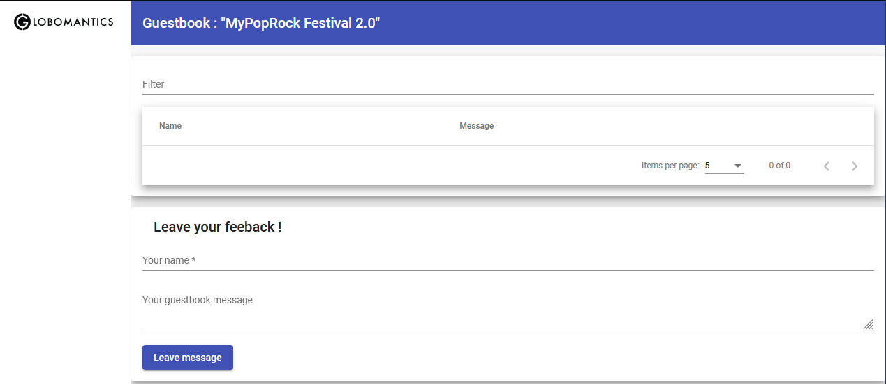

# GuestbookApp-Helm-Kubernetes
Packaging the Guestbook application using Helm charts for Kubernetes

# Guestbook Application

### Frontend 
The UI is an angular app that has an Ingress, cluster IP service, ConfigMap and deployment yaml files defining the Kubernetes objects. The config map stores specific information like the name of the guestbook, link to backend URI.

### Backend
The backend is a nodejs API that connects to the mongoDB database. It has a secrets.yaml that contains credentials and connection strings for the mongoDB.

### Database
The mongoDB database has secret and service definitions. It uses persistent volume and persistence volume Claims for defining the volumes.

The application files are taken from Pluralsight course "Packaging Applications with Helm for Kubernetes"

# Build instructions

The "chart" folder contains all the Kubernetes yaml files and the Helm chart build on it. 

`chart/guestbook` is the Umbrella Helm chart and has `chart.yaml` and `values.yaml` files at the global level. The dependencies are present in `chart/guestbook/charts`. These are helm packages from frontend, backend and database components which can be either manually copied from `chart/dist` or downloaded from a published repository. (Chartmuseum, github repo, or cloud storage options). 

To check if the dependencies are present use `helm dependency list guestbook`. In case of automatic downloads use `helm dependency update guestbook`. In this case, a "chart.lock" file will be generated indicating the dependencies and versions.

`chart\dist` contains the charts for the individual components frontend, backend and database. It also contains their packaged versions. If you were to make changes to the individual charts, they can be packaged again using command `helm package frontend backend database`. Make sure it is copied to `chart/guestbook/charts` folder to update the umbrella chart. Or else publish to chartmuseum or cloud repository to automatically update the dependencies.
 
# Environment setup

The original course uses Helm 3 with minikube deployed using a VirtualBox VM (Oracle), deployed in Linux environment. 
If using minikube:
* download and install virtual box
* when starting minukube makes sure to use `minikube start --driver=virtualbox` to use VM from virtualbox. Sometimes other options like Hyper-v can be chosen by default
* enable ingress: `minikube addons enable ingress`
* fetch the minikube node using `minikube ip`
* update "C:\Windows\System32\drivers\etc\hosts" file with two dedicated domains
	* <minikubeip> frontend.minikube.local
	* <minikubeip> backend.minikube.local
	* this should be updated according to domain name changes. For example: "dev.frontend.minikube.local"
* install kubectl and context should be correctly configured to "minikube". Verify using `kubectl config current-context`
* In case of issues with minikube setup, make sure to clean up using `minikube stop` and `minikube delete`

If using Windows 10:
* Turn on huper-v, restart
* install docker desktop, enable WSL2, once docker engine is running, enable Kubernetes
* set kubectl context to "docker-desktop". use `kubectl config use-context docker-desktop`
* install Helm 3

When using Hyper-V it is recommended to create and use a "Virtual-switch" setting from Hyper-V manager. Hyper-V manager -> virtual switch manager -> new virtual network switch -> "External". Create virtual switch and apply changes.

* helm - 3.7.0
* docker-desktop / kubernetes - 4.1.0. / 1.21.5
* docker desktop - 4.1.0
* minikube - 1.23.2

# References
Packaging Applications with Helm for Kubernetes
https://app.pluralsight.com/library/courses/kubernetes-packaging-applications-helm 
